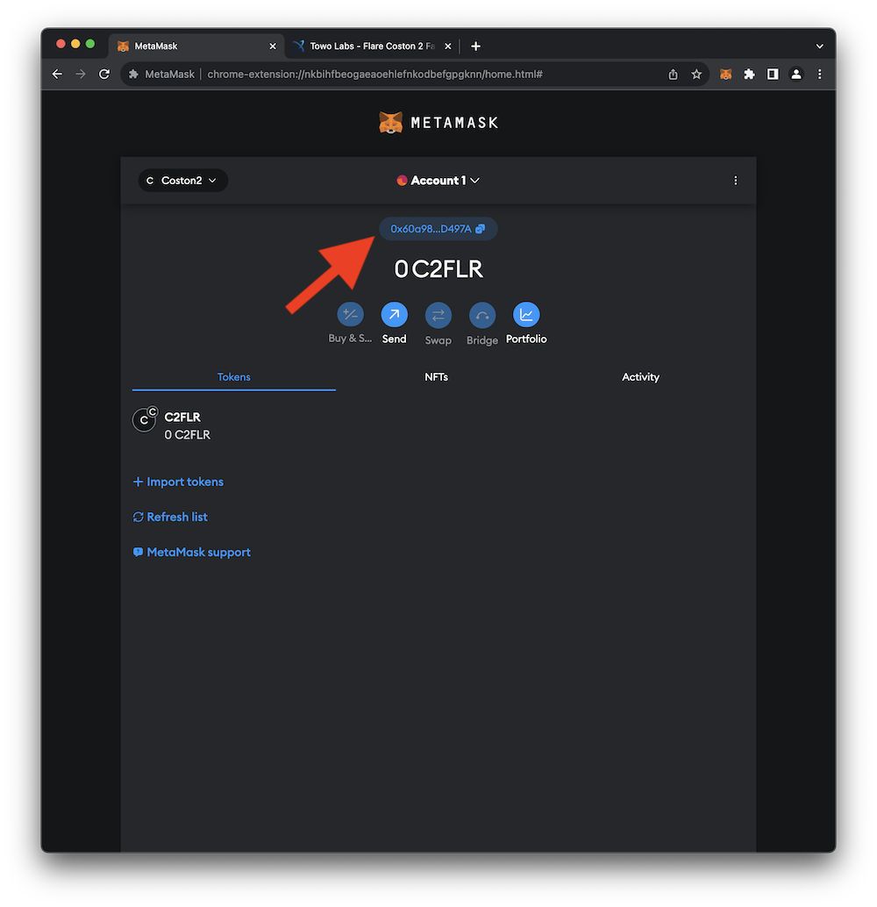
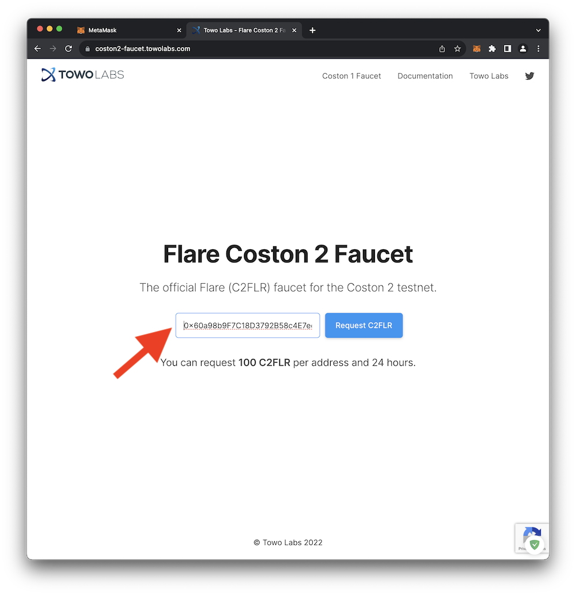
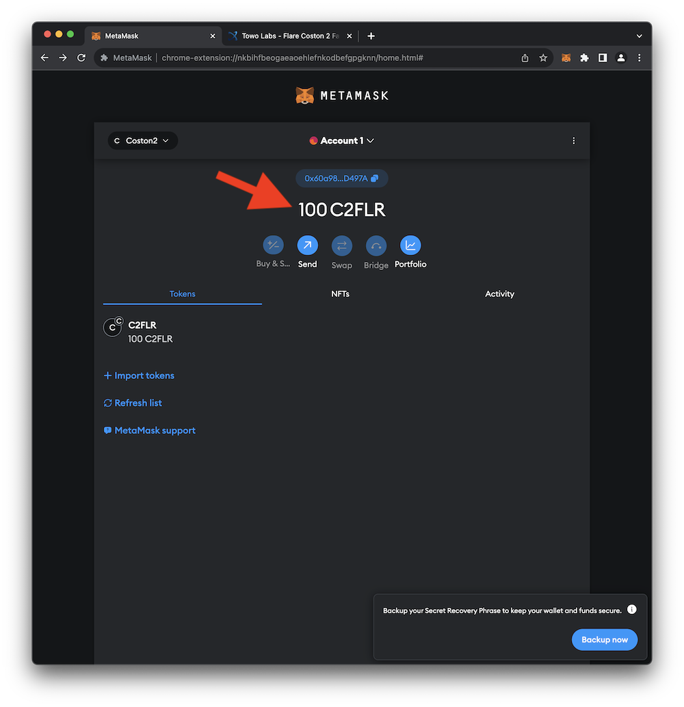

# Acquiring Testnet Tokens

As noted previously, testnet tokens are distinct from their _mainnet_ counterparts and hold no real-world value. These testnet tokens can be acquired for free from distribution services called **_faucets_**.  You may have noticed the URL for the **Coston2** faucet when viewing the **_Flare Network_** settings [here](https://docs.flare.network/dev/reference/network-config/).

 

## Visit the Coston2 Faucet

1. You'll need to provide the address of your **_Flare Network_** account to the faucet so the faucet knows where to send the testnet tokens. You can easily copy your address into your clipboard by clicking on the address in MetaMask as shown in the image below.
     
    { loading=lazy width="600" }
2. Access the Coston2 faucet [here](https://coston2-faucet.towolabs.com) and paste your address into the provided **_Flare address_** field as shown below. Click **Requset C2FLR** to request your testnet tokens. After making the request you can close the website for the faucet.
     
    { loading=lazy width="600" }
3. Return to your MetaMask browser extension and refresh your browser. Within a few seconds you should see that you have received 100 worthless **C2FLR** testnet tokens.
     
    { loading=lazy width="600" }

   