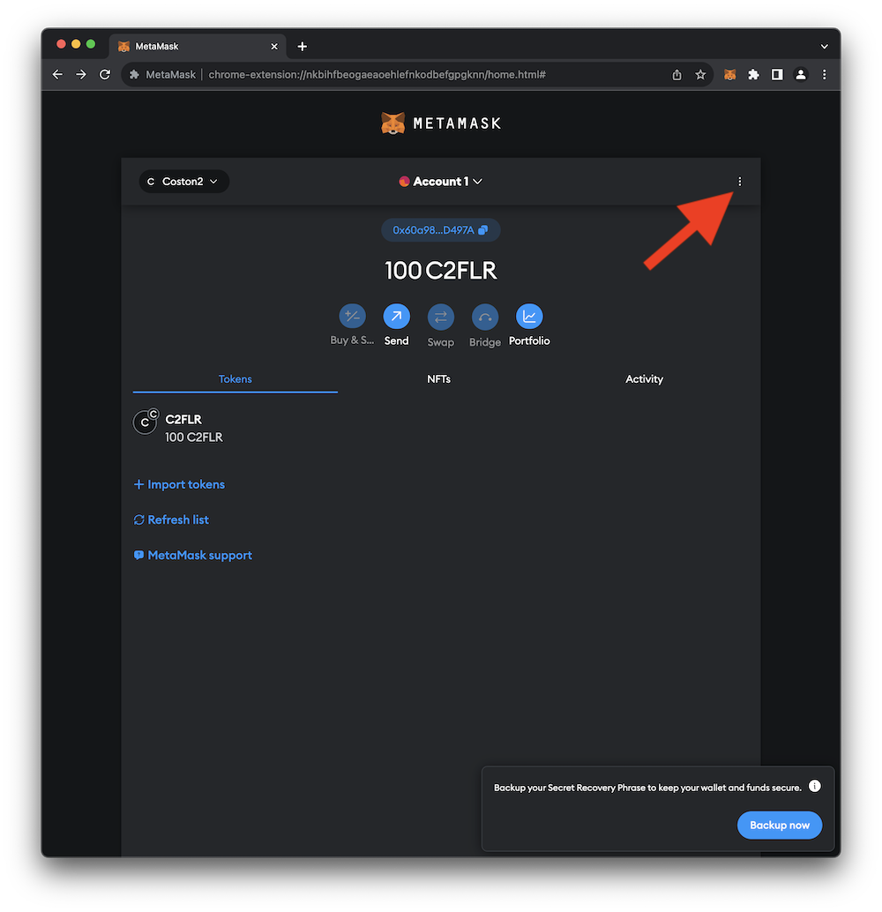
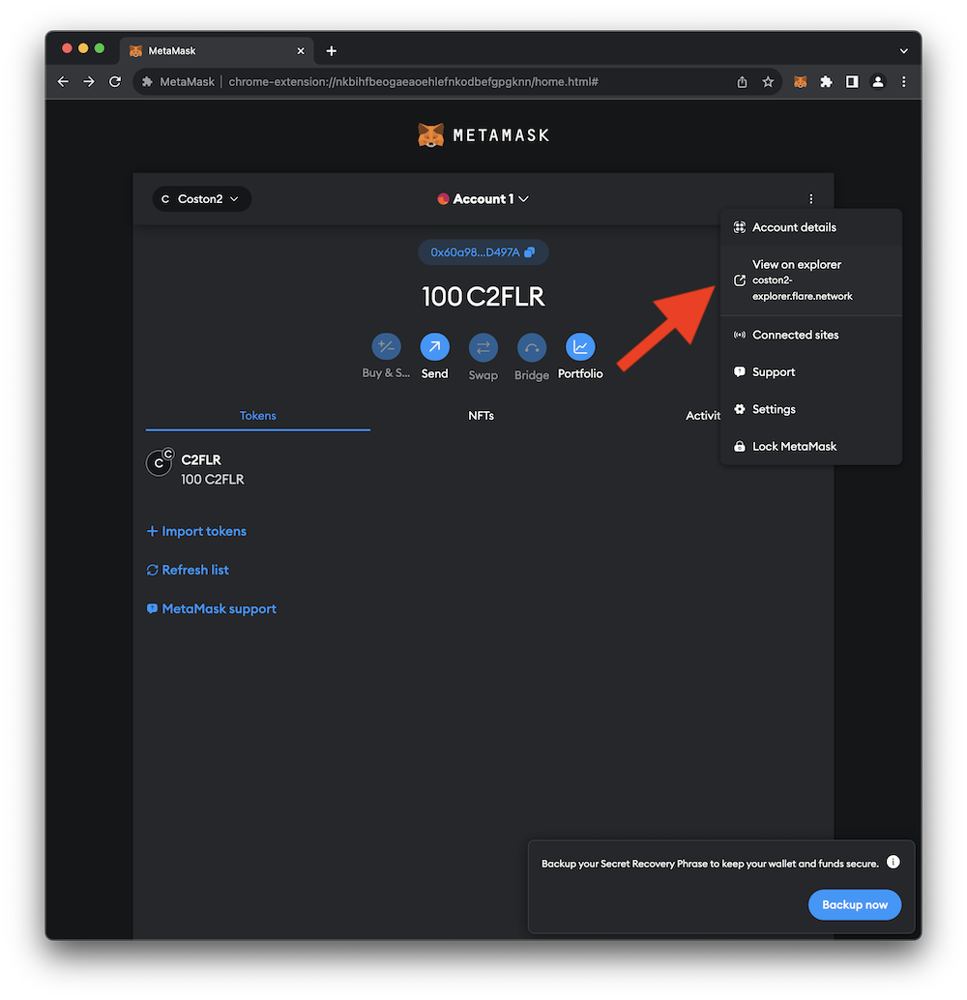
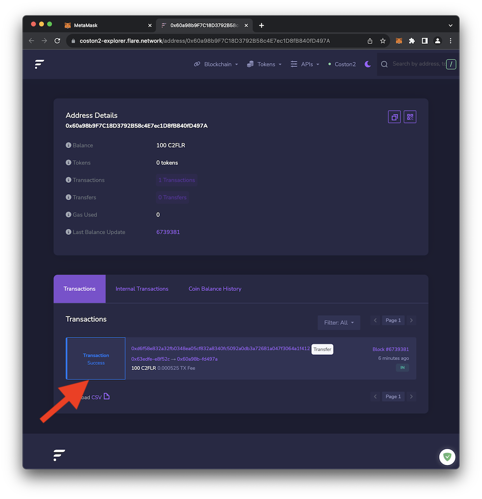
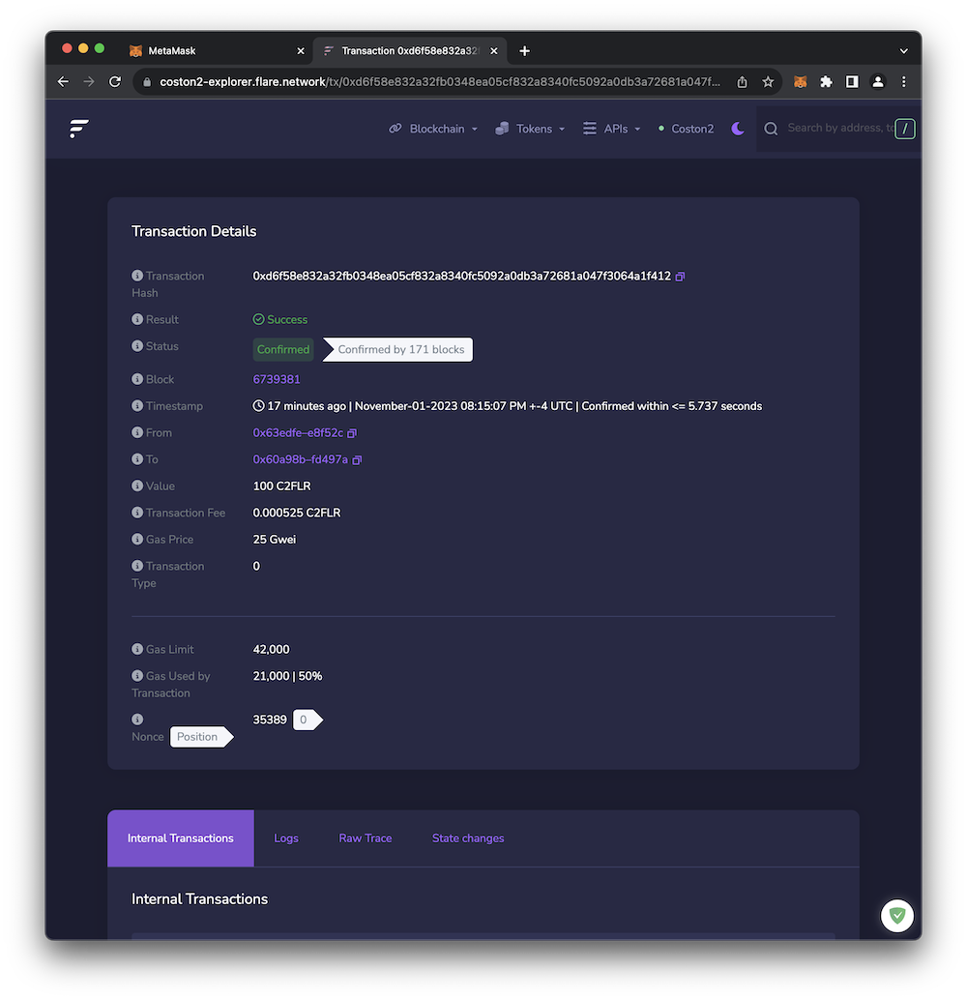

# Blockchain Explorers

Most blockchains provide full transparency which means you can view all the transactions that occur on the blockchain. Typically, this information is available via a **_Blockchain Explorer_**. A Blockchain Explorer is simply a website that presents blockchain activity in a user-friendly and easy-to-read format. MetaMask provides a convenient shortcut for visiting Blockchain Explorers as described below.

 

## Visit the Flare Network Blockchain Explorer

1. The Coston2 Blockchain Explorer is available [here](https://coston2-explorer.flare.network/).  You can also access the Blockchain Explorer through MetaMask and jump directly to your account's transaction history. Click on the triple-dot menu (:material-dots-vertical:) in MetaMask as shown in the  image below.
     
    { loading=lazy width="600" }
2. Click **View on explorer** as shown below. This should open a new browser window with details for your blockchain address.
     
    { loading=lazy width="600" }
3. If this is a new account, you should see a single successful transaction in your transaction history window. This is the transaction performed by the **Coston2** faucet when it sent 100 **C2FLR** to your account.
     
    { loading=lazy width="600" }
4. Clicking the _transaction ID_ (the long hexadecimal string at the top of the transaction box) provides additional detail about the transaction as shown below.
     
    { loading=lazy width="600" }