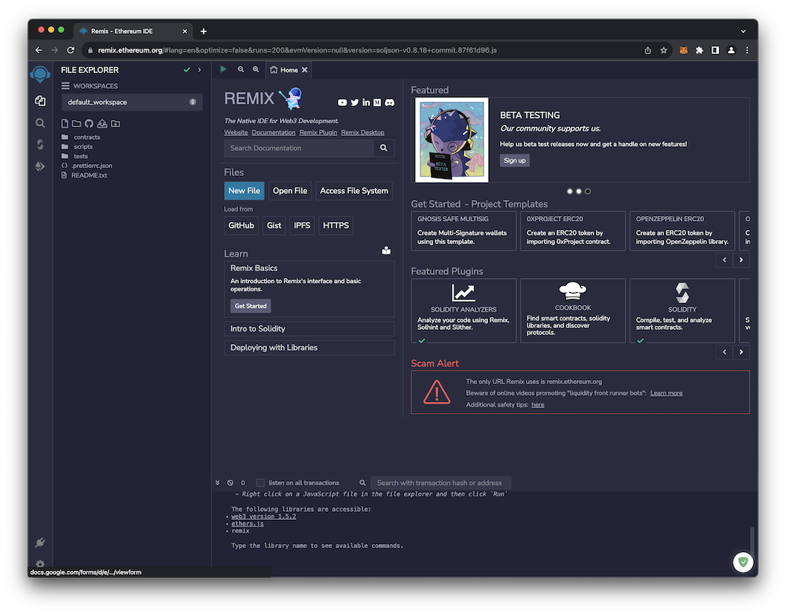
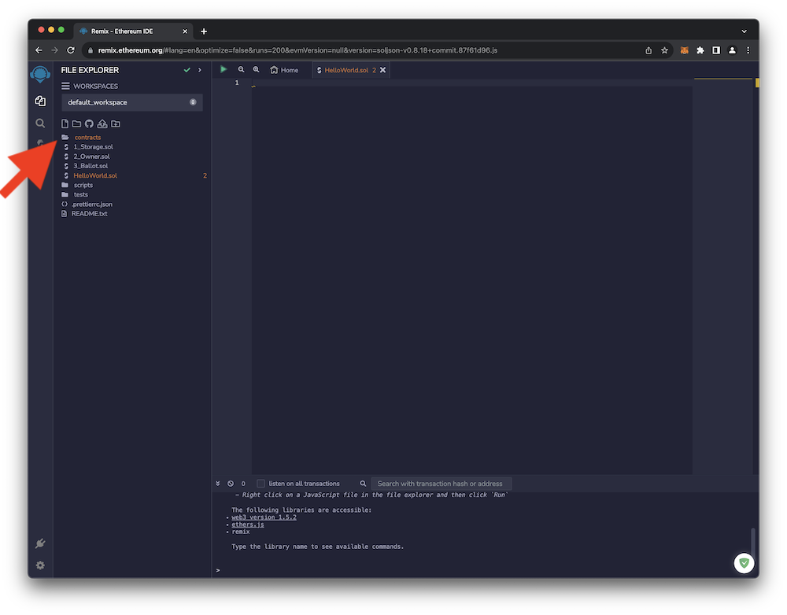
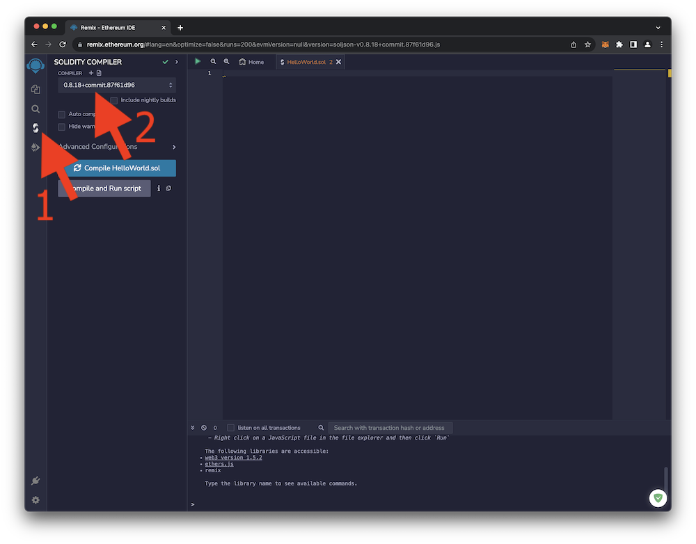
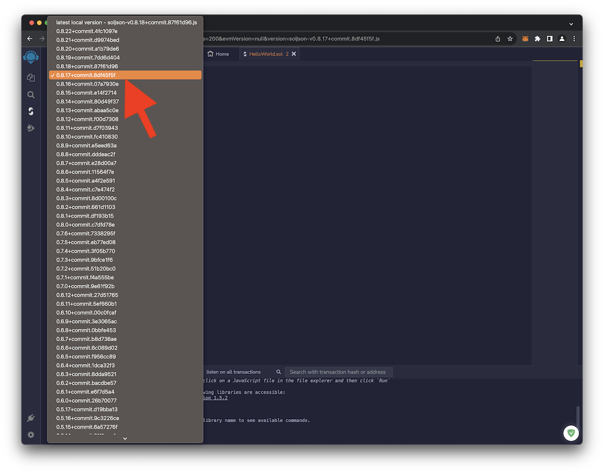

# Building a Smart Contract

There are many blockchains and many smart contract platforms in existence. Additionally, there are a wide variety of programming languages available in which one could develop smart contracts. This guide targets the **_[Ethereum Virtual Machine](https://ethereum.org/en/developers/docs/evm/)_** (**EVM**) runtime environment. The EVM was originally written for and deployed on the **_[Ethereum](https://ethereum.org)_** blockchain. Since then, the EVM has been ported to run as the default smart contract execution environment on numerous blockchains, including the **_[Flare Network](https://flare.network)_**.

Currently, the most common programming language used by smart contract developers is **_[Solidity](https://soliditylang.org)_**. It's a fairly straightforward language if you have experience with languages like C or JavaScript. Solidity code is compiled to _EVM bytecode_ which is then deployed onto the blockchain and executed by the EVM as part of a blockchain transaction.  While it's fairly quick to set up a local environment to compile and deploy Solidity programs, it's even quicker to utilize an online IDE. For this guide, we'll use the **_[Remix Project](https://remix-project.org)_** which hosts an online IDE capable of compiling and deploying Solidity.

For this guide, we'll write a simple **_Hello World_** smart contract.

<br>
<hr>

## Let's Get Coding

1. Start by launching the **_[Remix Online IDE](https://remix.ethereum.org/)_**. If this is your first time launching the IDE, you'll likely see a welcome message and a very brief tour of the user interface. After the tour, you should have a basic environment that looks like the following.
    <br>
    { loading=lazy width="600" }
    <br>
2. To create a new smart contract file, first click the **contracts** folder in the **FILE EXPLORER** column, then click the **Create new file** icon ( :octicons-file-16: ) just above the **contracts** folder. Name your new smart contract file **HelloWorld.sol** as shown below.
    <br>
    { loading=lazy width="600" }
    <br>
If your **HelloWorld.sol** file was created outside of the **contracts** folder, simply drag the file into folder.
    <br><br>
3. In the left sidebar, open the Solidity compiler settings and the click the compiler version drop down box.
    <br>
    { loading=lazy width="600" }
    <br>
Select compiler version **0.8.17**.
    <br>
    { loading=lazy width="600" }
    <br>
4. Return to your **HelloWorld.sol** file and enter the following as the first couple lines of your smart contract.
```solidity title="HelloWorld.sol" linenums="1"
// SPDX-License-Identifier: MIT
pragma solidity 0.8.17;
```
**_Line 1_** specifies the license for this smart contract. While this isn't strictly required, the Remix Online IDE complains too much if it's not included.<br><br>
**_Line 2_** specifies the version of the compiler that should be used to compile this smart contract.
    <br><br>
5. Next, define the contract body using the **_contract_** keyword followed by the name of the contract, **_HelloWorld_**. Add in some curly-braces to enclose the body.
```solidity title="HelloWorld.sol" linenums="1" hl_lines="4-6"
// SPDX-License-Identifier: MIT
pragma solidity 0.8.17;

contract HelloWorld {

}
```
The contract body is where we'll put state variables as well as the functions necessary to modify those variables.
    <br><br>
6. Define your first smart contract variable, a **_string_** called **_message_** as shown below.
```solidity title="HelloWorld.sol" linenums="1" hl_lines="5"
// SPDX-License-Identifier: MIT
pragma solidity 0.8.17;

contract HelloWorld {
    string public message;
}
```
Since this variable is public, it will exist on the blockchain and be visible to everyone.
    <br><br>
7. Time to create a **_constructor_** for your smart contract. The constructor runs only once, when the smart contract is deployed. Because of this, the constructor is often used to provide special permission to the account that deployed the smart contract. For now, just create a basic constructor that accepts an initial value for the **_message_** value as shown below.
```solidity title="HelloWorld.sol" linenums="1" hl_lines="7-9"
// SPDX-License-Identifier: MIT
pragma solidity 0.8.17;

contract HelloWorld {
    string public message;

    constructor(string memory initialMessage) {
        message = initialMessage;
    }
}
```
The constructor accepts an argument named **_initialMessage_** and assigns the value of that argument to the contract's state variable **_message_**.  The **_memory_** keyword is one of several keywords that Solidity uses to define where a piece of data should be stored. Specifically, the **_memory_** keyword indicates that the value of **_initialMessage_** only exists during the lifetime of the constructor. 
    <br><br>
8. Next, create a **_function_** that updates the value of the state variable **_message_**.
```solidity title="HelloWorld.sol" linenums="1" hl_lines="11-13"
// SPDX-License-Identifier: MIT
pragma solidity 0.8.17;

contract HelloWorld {
    string public message;

    constructor(string memory initialMessage) {
        message = initialMessage;
    }

    function updateMessage(string memory newMessage) public {
        message = newMessage;
    }
}
```
The **_public_** modifier indicates that this function can be called from outside of this smart contract (i.e. as part of a blockchain transaction). To create functions that can only be called from within the smart contract, set the access modifier to **_private_**.
<br><br>
This is now a complete smart contract and can be deployed as-is.  However, we can add some more functionality to make it a bit more interesting.
    <br><br>
9. Solidity provides the ability to log additional information to the blockchain and to notify external entities of **_events_** that occur. To add this to the smart contract, let's define an **_event_** that can log some information when the **_updateMessage_** function is called.
```solidity title="HelloWorld.sol" linenums="1" hl_lines="6"
// SPDX-License-Identifier: MIT
pragma solidity 0.8.17;

contract HelloWorld {
    string public message;
    event updatedMessage(string oldMessage, string newMessage);

    constructor(string memory initialMessage) {
        message = initialMessage;
    }

    function updateMessage(string memory newMessage) public {
        message = newMessage;
    }
}
```
    <br>
10. Next, **_emit_** the event when the **_updateMessage_** function is called by adding the following code on lines 13 and 15.
```solidity title="HelloWorld.sol" linenums="1" hl_lines="13 15"
// SPDX-License-Identifier: MIT
pragma solidity 0.8.17;

contract HelloWorld {
    string public message;
    event updatedMessage(string oldMessage, string newMessage);

    constructor(string memory initialMessage) {
        message = initialMessage;
    }

    function updateMessage(string memory newMessage) public {
        string memory oldMessage = message;
        message = newMessage;
        emit updatedMessage(oldMessage, newMessage);
    }
}
```
    <br>
11. Finally, let's ensure that only the owner of this smart contract can update the **_message_** value. To do this, the contract needs to store the address that deployed the contract. This can be done with a new state variable, a quick modification to the **_constructor_**, and another quick modification to the **_updateMessage_** function as shown below.
```solidity title="HelloWorld.sol" linenums="1" hl_lines="5 10 15"
// SPDX-License-Identifier: MIT
pragma solidity 0.8.17;

contract HelloWorld {
    address public owner;
    string public message;
    event updatedMessage(string oldMessage, string newMessage);

    constructor(string memory initialMessage) {
        owner = msg.sender;
        message = initialMessage;
    }

    function updateMessage(string memory newMessage) public {
        require(msg.sender == owner);
        string memory oldMessage = message;
        message = newMessage;
        emit updatedMessage(oldMessage, newMessage);
    }
}
```
**_Line 5_** creates the state variable that will store the **_address_** of whomever deploys the contract (i.e. the **_owner_**). 
<br><br>
**_Line 10_** assigns the **_owner_** of the contract using the built-in value **_msg.sender_**. The **_msg_** is the blockchain transaction. It has many properties, including **_sender_** and **_receiver_**. For this smart contract we want the message sender (**_msg.sender_**) to be the owner.
<br><br>
**_Line 15_** checks the address of the **_sender_** that called **_updateMessage_**. If the **_sender_** address matches that of the **_owner_** the **_updateMessage_** function will run and modify the **_message_** state variable. If the address of the **_sender_** is NOT the owner's, the **_updateMessage_** function will fail.
<br><br>