# Deploying a Smart Contract

The **_[Remix Online IDE](https://remix.ethereum.org/)_** provides all the facilities to deploy your new smart contract directly to the blockchain. This portion of the guide walks through deploying your smart contract on the **_[Flare Network](https://flare.network)_**.

 

1. Select the Solidity compiler tab from the sidebar of Remix.
     
    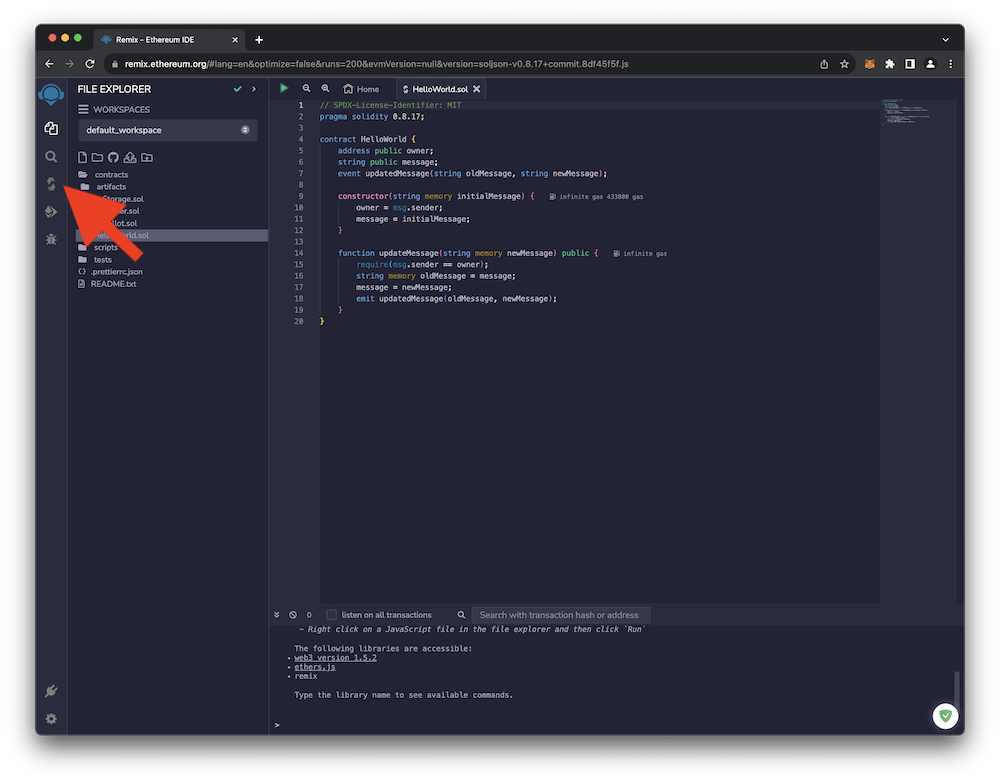{ loading=lazy width="600" }
2. Click the **Compile HelloWorld.sol** button.
     
    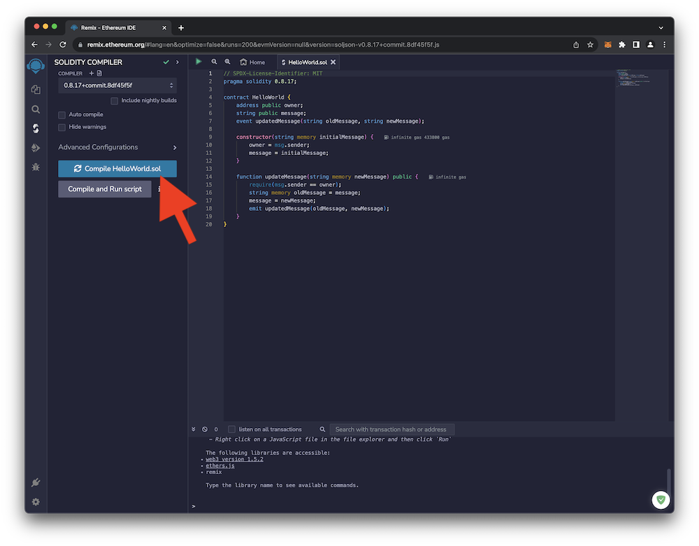{ loading=lazy width="600" }
     
    If you have any errors or typos, be sure to fix them.
     
3. Select the **Deploy & run transactions** tab from the sidebar of Remix.
     
    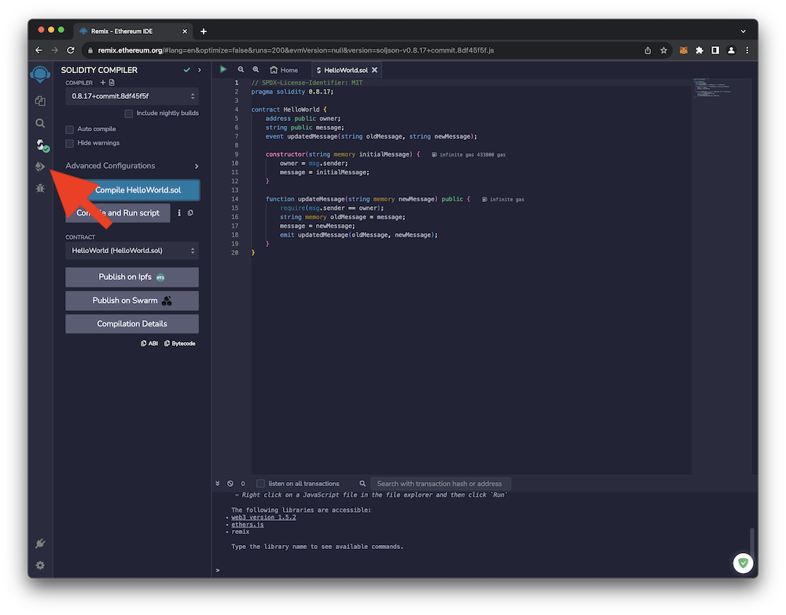{ loading=lazy width="600" }
4. In the **ENVIRONMENT** drop down box, select **Injected Provider - MetaMask**. 
     
    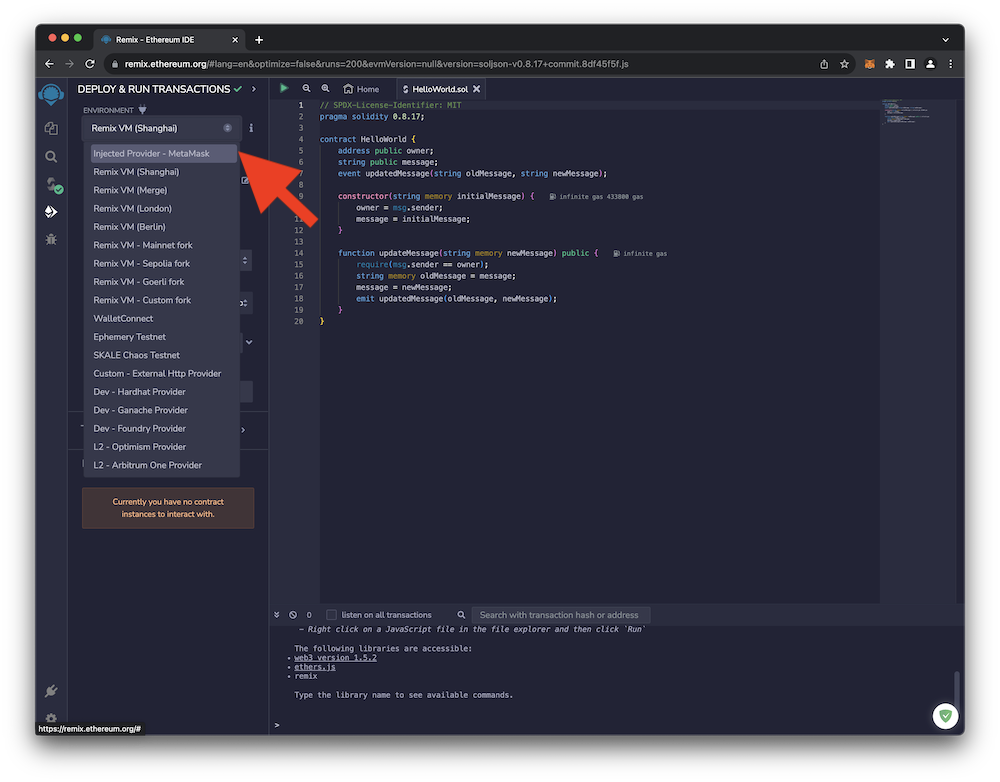{ loading=lazy width="600" }
     
    This should spring MetaMask into action. Ensure that the account with your 100 **C2FLR** is selected and click **Next**.
     
    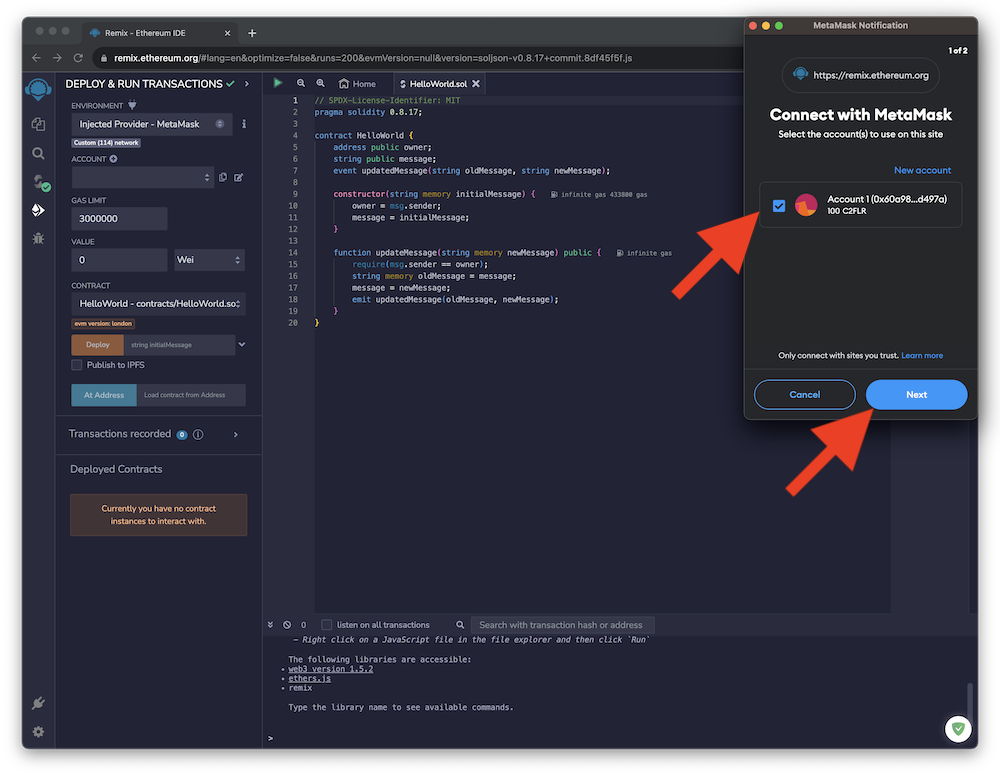{ loading=lazy width="600" }
     
    Allow Remix to connect to MetaMask by clicking **Connect**.
     
    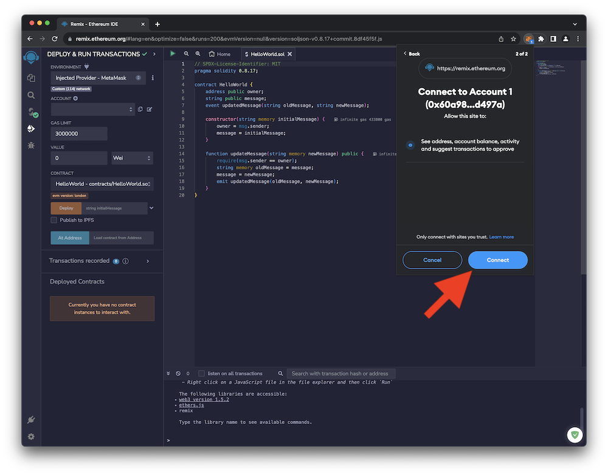{ loading=lazy width="600" }
     
    Remix should now be able to connect with and communicate with MetaMask. Remix will utilize MetaMask to sign transactions with your address. You should see your address in the Remix sidebar under **ACCOUNT**.
     
    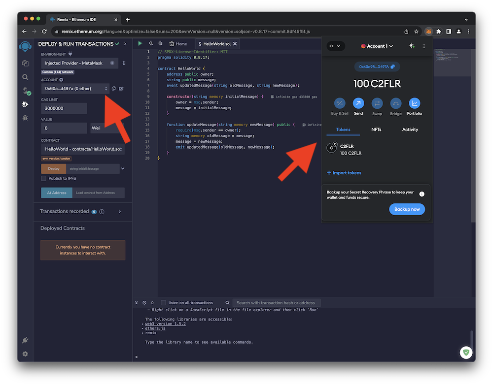{ loading=lazy width="600" }
      
5. Type an **initialMessage** into the text field prior to deployment. Click the **Deploy** button and confirm the **CONTRACT DEPLOYMENT** transaction in MetaMask.
     
    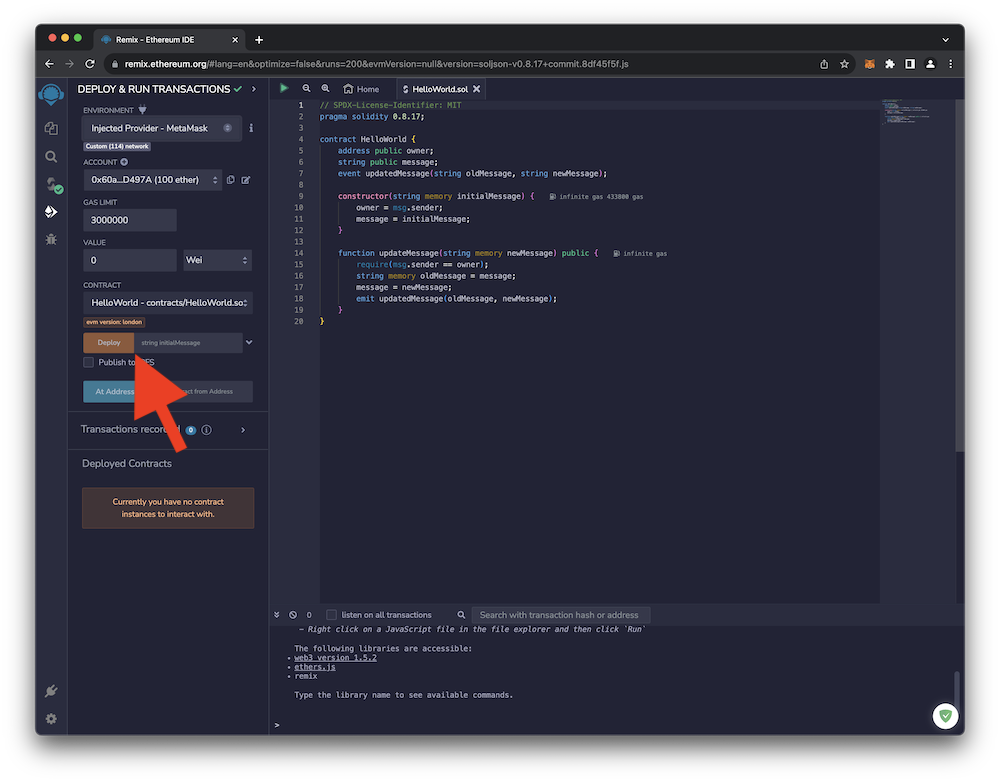{ loading=lazy width="600" }
     
    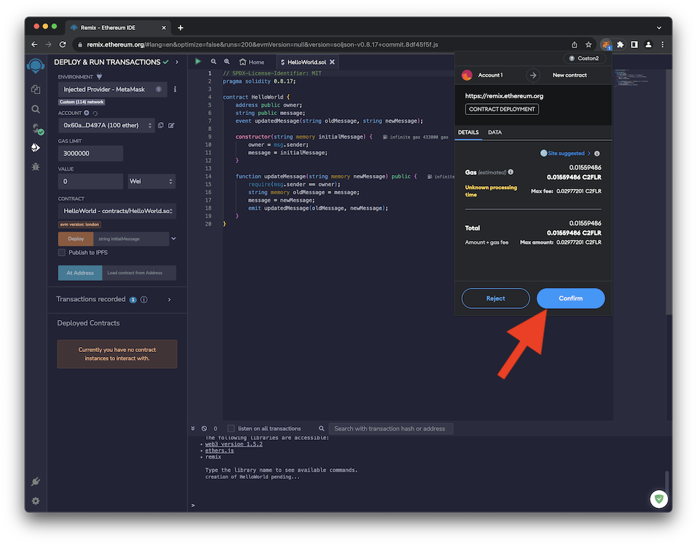{ loading=lazy width="600" }
     
    If all goes well, you should see several indications that your smart contract was successfully deployed.
     
    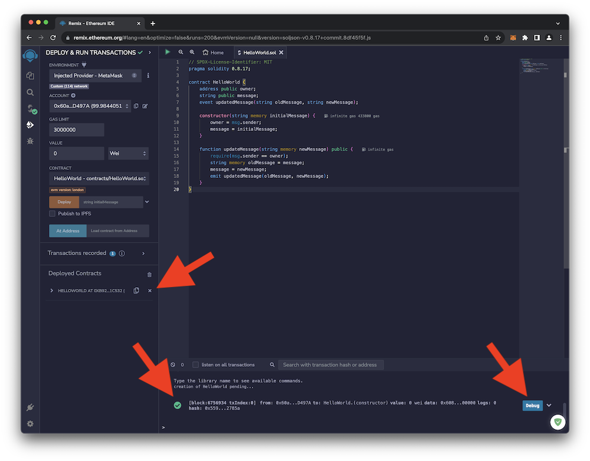{ loading=lazy width="600" }
     
    Click on the down arrow next to the **DEBUG** button to see some information about your smart contract, including the smart contract address.
      
    You can also see the contract name in the left sidebar.  Copy the smart contract address and paste it into the **Search** field on the **[Coston2 Blockchain Explorer](https://coston2-explorer.flare.network/)** to find your smart contract on the blockchain.
     
    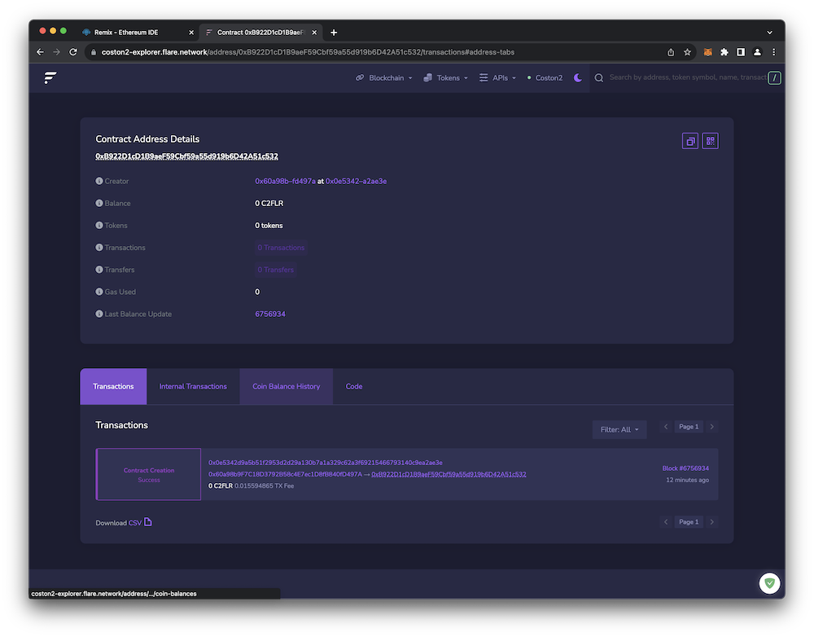{ loading=lazy width="600" }
     