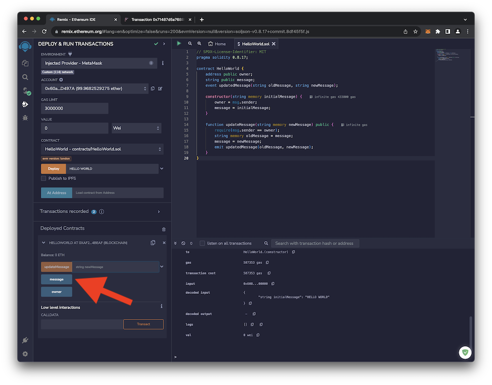
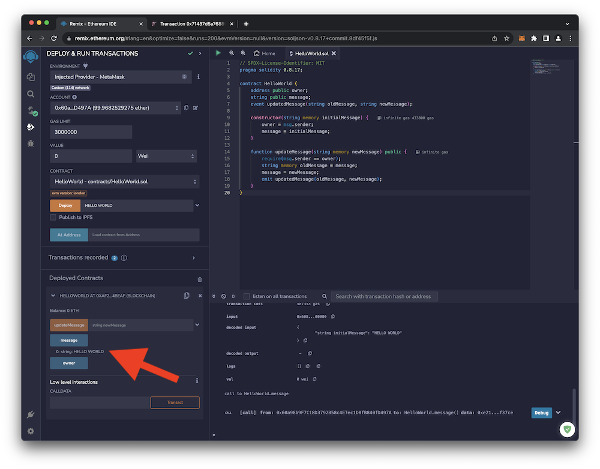
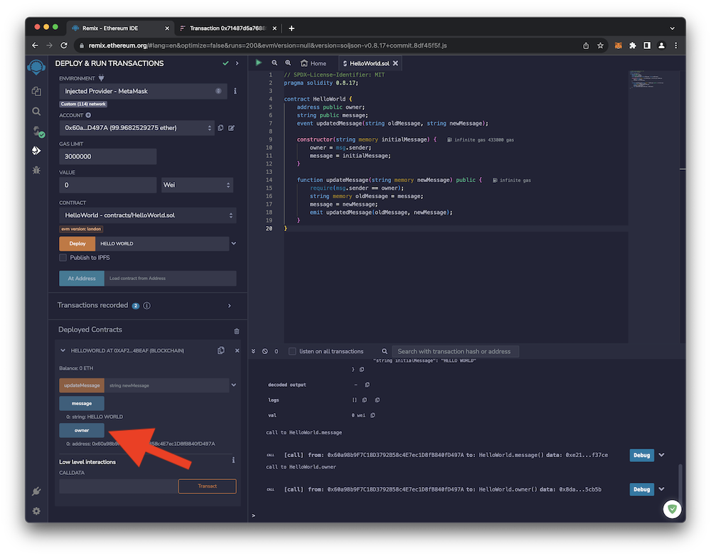
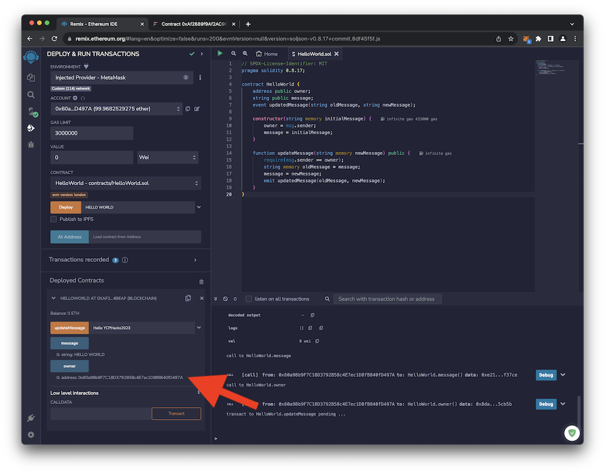
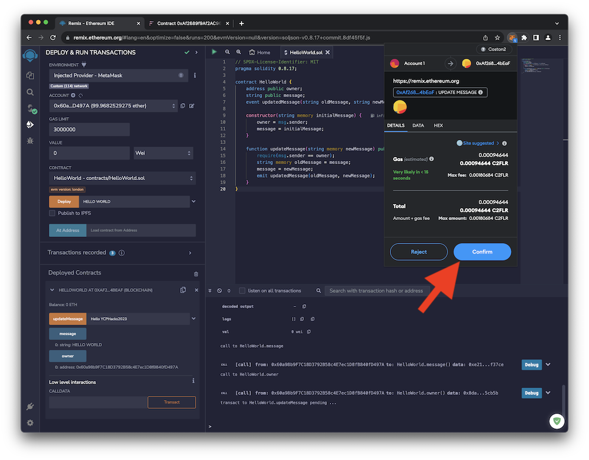
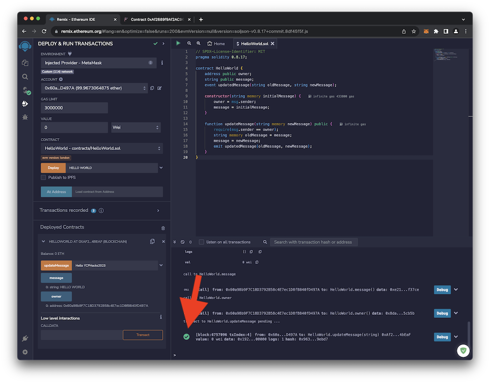
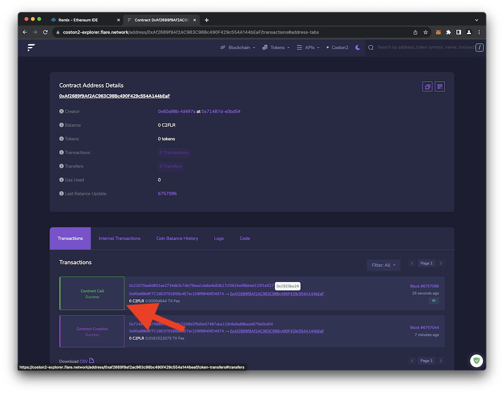
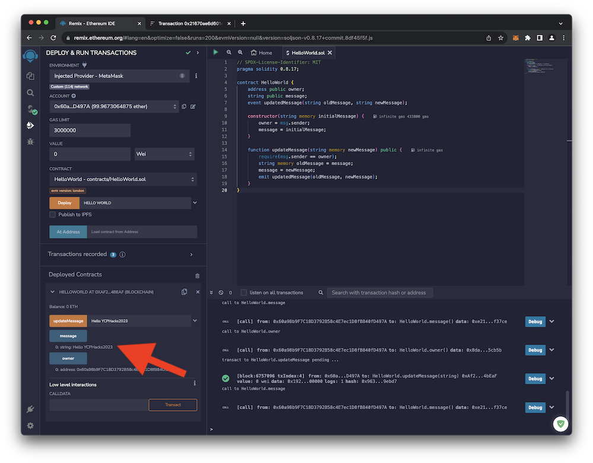

# Interacting with your Smart Contract

1.
     
    { loading=lazy width="600" }
     
    { loading=lazy width="600" }
      
2.
     
    { loading=lazy width="600" }
     
3.
     
    { loading=lazy width="600" }
     
    { loading=lazy width="600" }
      
4.
     
    { loading=lazy width="600" }
     
5.
     
    { loading=lazy width="600" }
     
6.
     
    { loading=lazy width="600" }
     