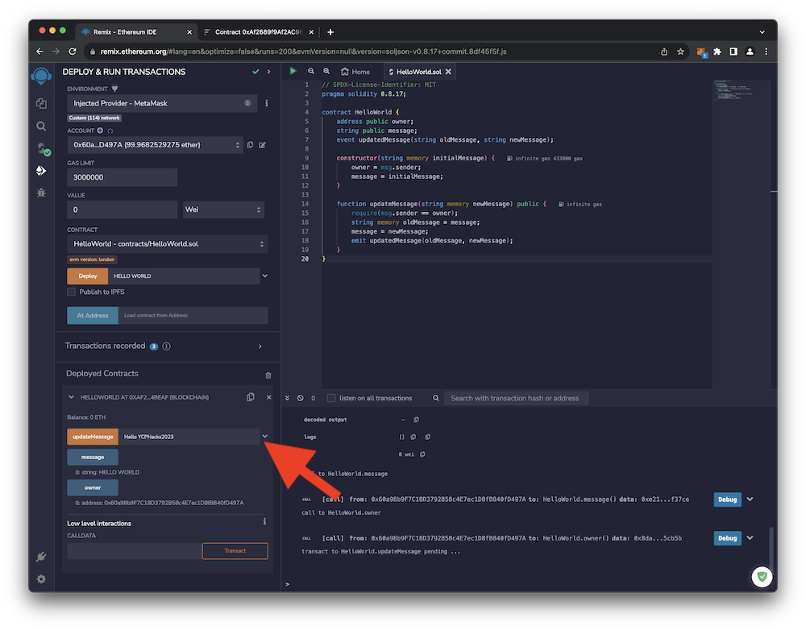

# Interacting with your Smart Contract

The **_[Remix Online IDE](https://remix.ethereum.org/)_** provides a convenient interface to interact with and test your new smart contract. This portion of the guide walks through interacting with your smart contract on the **_[Flare Network](https://flare.network)_**.

For a real-world deployment, you can utilize JavaScript and/or other web technologies to interact with your smart contract.

 

1. In the left sidebar of the Remix interface, find the **Deployed Contracts** area and expand the information about your **Hello World** smart contract. Remix understands the interface for your smart contract and generates a simple user interface. The blue buttons simple query the smart contract for information but don't modify the state of the contract. The orange button modifies the state of the smart contract and thus will require that you sign the transaction.
     
    { loading=lazy width="600" }
     
    Click on the blue **message** button to see the **message** value currently stored by the smart contract.
     
    { loading=lazy width="600" }
      
2. Click on the blue **owner** button to see the **owner** value stored by the smart contract. Note that the **owner** value cannot be changed as it was set in the constructor.
     
    { loading=lazy width="600" }
     
    You should see your Flare Network address.
     
    { loading=lazy width="600" }
     
3. To write a new **message** value to the contract, enter the text of your new message into the **updateMessage** box and click the **updateMessage** button.
     
    { loading=lazy width="600" }
     
    Since you're writing to the smart contract, you'll need to sign this transaction.  MetaMask should pop up automatically. Review the transaction details and click **Confirm**.
     
    { loading=lazy width="600" }
      
4. If the transaction is successful, you'll see message in the console window indicating the transaction is complete. Expanding the message will reveal additional information, including the text that is emitted by the **updatedMessage** event.
     
    { loading=lazy width="600" }
     
5. Return to the **[Coston2 Blockchain Explorer](https://coston2-explorer.flare.network/)** and find your smart contract by searching its address. You'll see a transaction labeled **Contract Call Success**.  This is the transaction that you issued to update the **message** state of the smart contract.
     
    { loading=lazy width="600" }
     
6. Back in the Remix window, click on the blue **message** button once again. You should now see the new message.
     
    { loading=lazy width="600" }
     