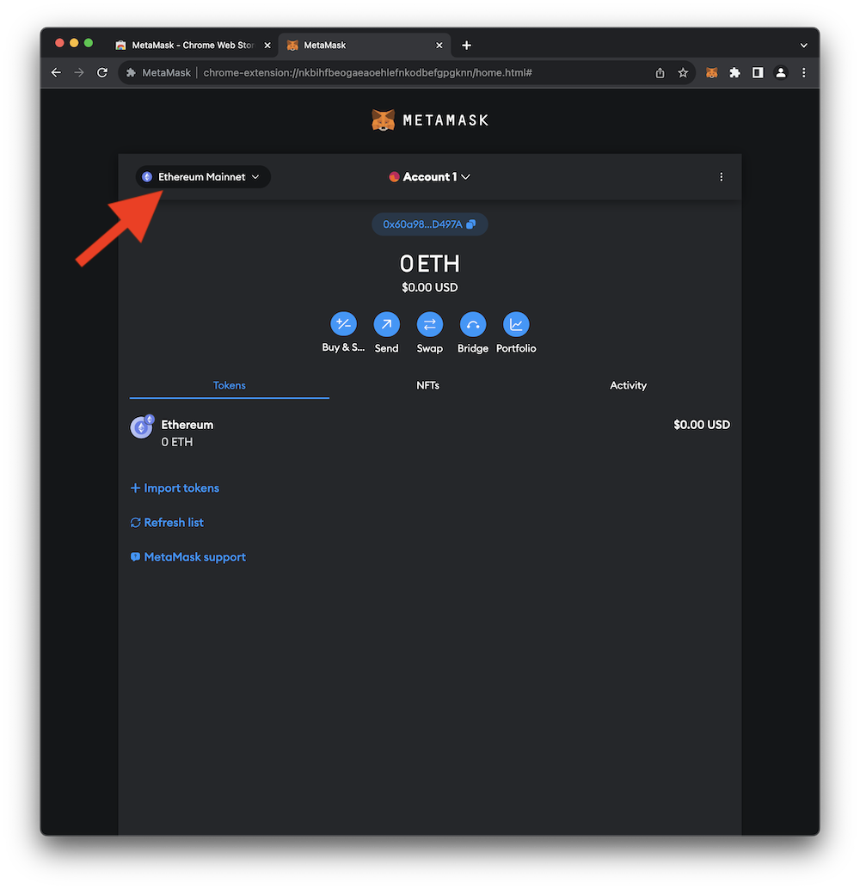
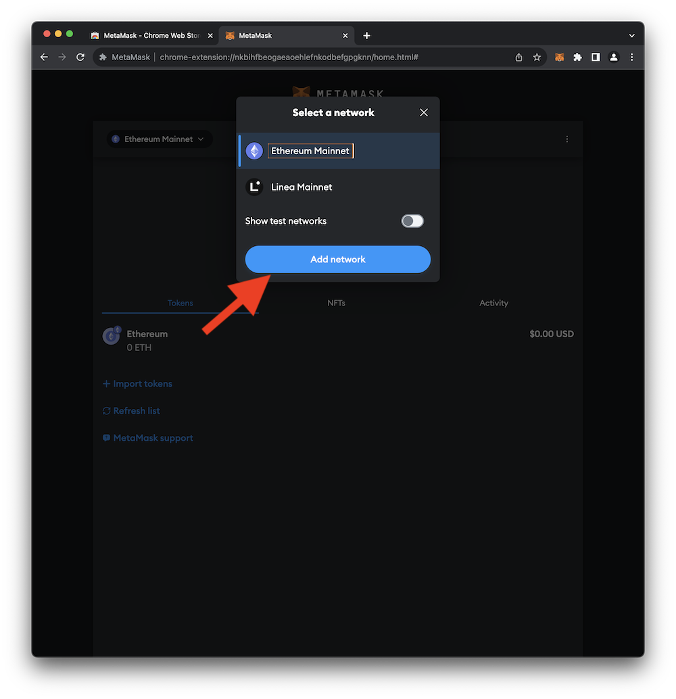
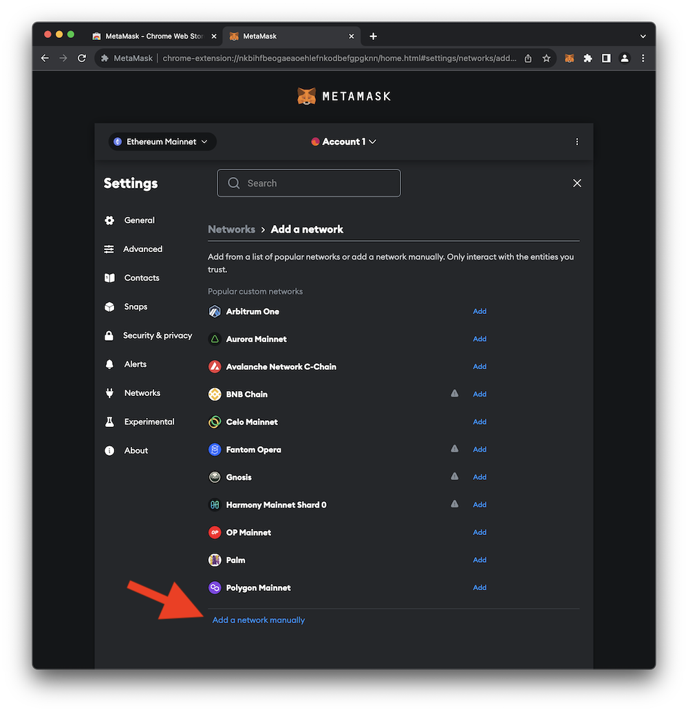
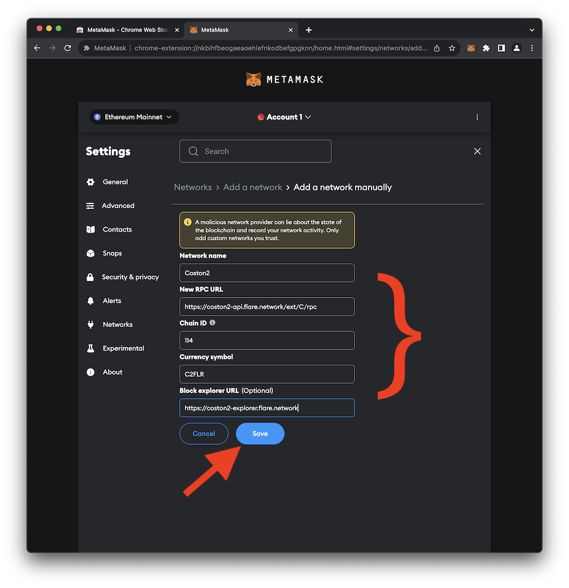
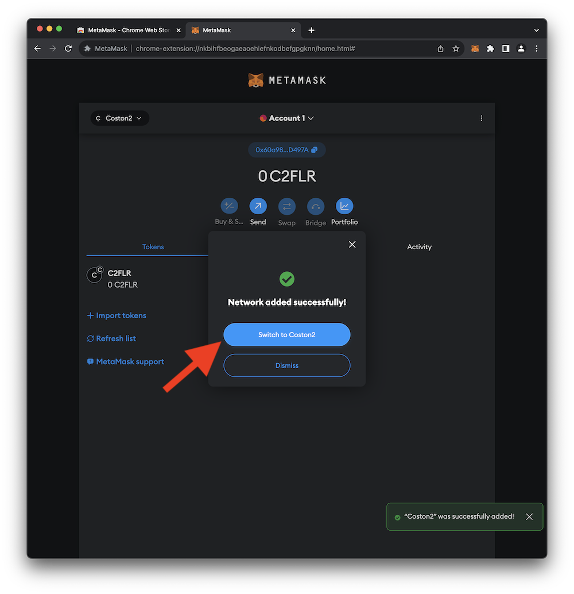
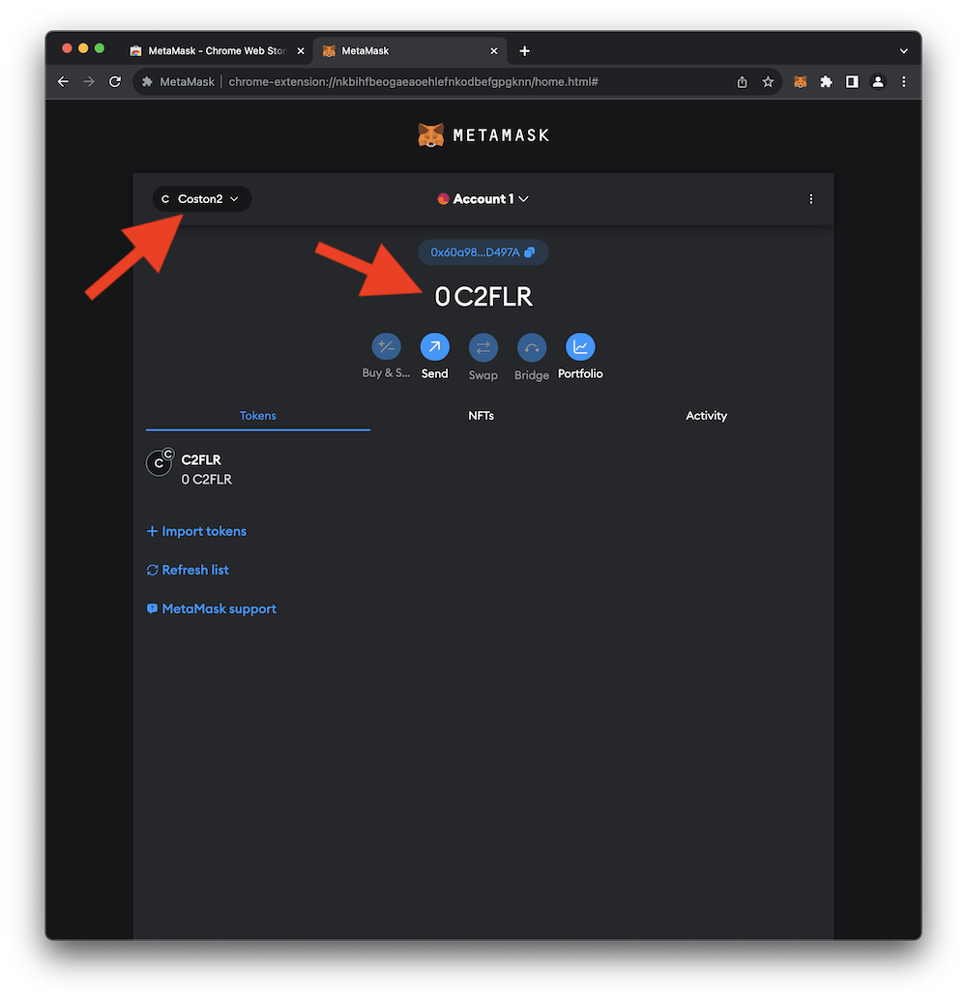

# MetaMask Configuration

By default, MetaMask connects to the **_[Ethereum](https://ethereum.org) Mainnet_** blockchain.  The **_Ethereum Mainnet_** is home to the **_Ether_** (**ETH**) cryptocurrency.  Since transaction times on **_Ethereum_** can be a bit unpredictable (and occasionally sluggish), it's not well-suited for a time-limited workshop. Instead, of **_Ethereum_**, this guide utilizes the **_[Flare Network](https://flare.network/)_** project. 

During development, and for the purposes of this guide, it wouldn't be wise to interact with a network that holds real-world value.  There are many **_test networks_** associated with various crypto projects (including both **_Ethereum_** and the **_Flare Network_**). A **_test network_** (a.k.a. a _testnet_) is an instance of a blockchain network used for testing and development. Testnet tokens are distinct from their _mainnet_ counterparts and hold no real-world value. These testnet tokens can be acquired for free from distribution services called **_faucets_**.

This portion of the guide walks through the process of configuring MetaMask to connect to **_Flare Network_**'s testnet called **_Coston2_**.  The settings for the **_Flare Network_** **_Coston2_** testnet are located [here](https://docs.flare.network/dev/reference/network-config/). The steps below describe how to set up access to this blockchain in MetaMask.

<br>
<hr>

## Selecting a Network

1. To get started, open the MetaMask browser extension and click on the network selection button as shown in the image below.
    <br>
    { loading=lazy width="600" }
2. In the small pop-up window, click **Add network**.
    <br>
    { loading=lazy width="600" }
3. Next, click **Add a network manually**.
    <br>
    { loading=lazy width="600" }
4. Populate the **Network Name**, **New RPC URL**, **Chain ID**, **Currency symbol**, and **Blockchain explorer URL** with the following values.
<br>
```title="Network Name"
Coston2
```
```title="New RPC URL"
https://coston2-api.flare.network/ext/C/rpc
```
```title="Chain ID"
114
```
```title="Currency symbol"
C2FLR
```
```title="Blockchain explorer URL"
https://coston2-explorer.flare.network
```
When complete, your settings should match those in the image below. Click **Save** to add the network.
    { loading=lazy width="600" }
5. You should see a message indicating that the network was successfully added.  Click **Switch to Coston2** to use the Coston2 testnet.
    <br>
    { loading=lazy width="600" }
6. MetaMask should now show that you're connected to Coston2 and that you have zero **C2FLR** tokens.
    <br>
    { loading=lazy width="600" }

