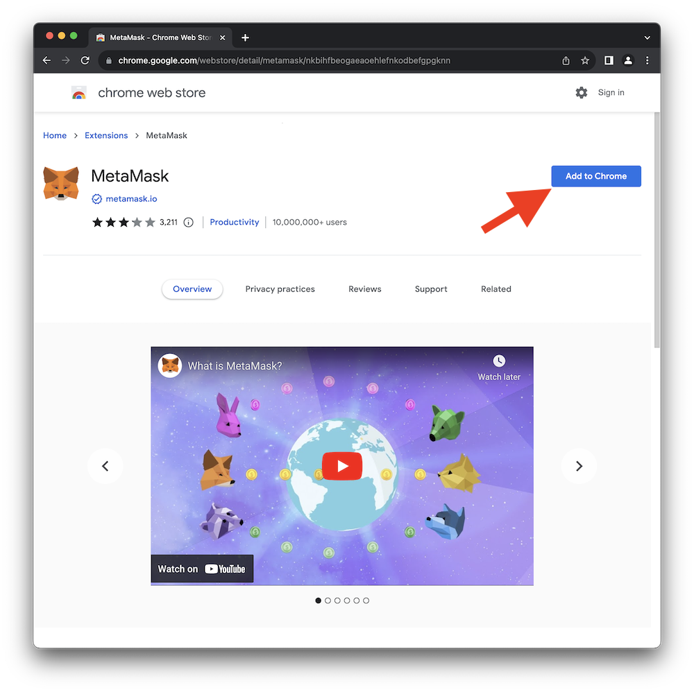
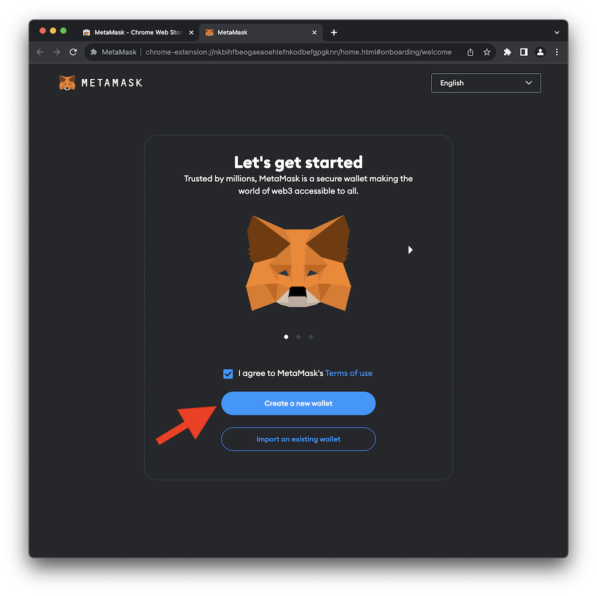
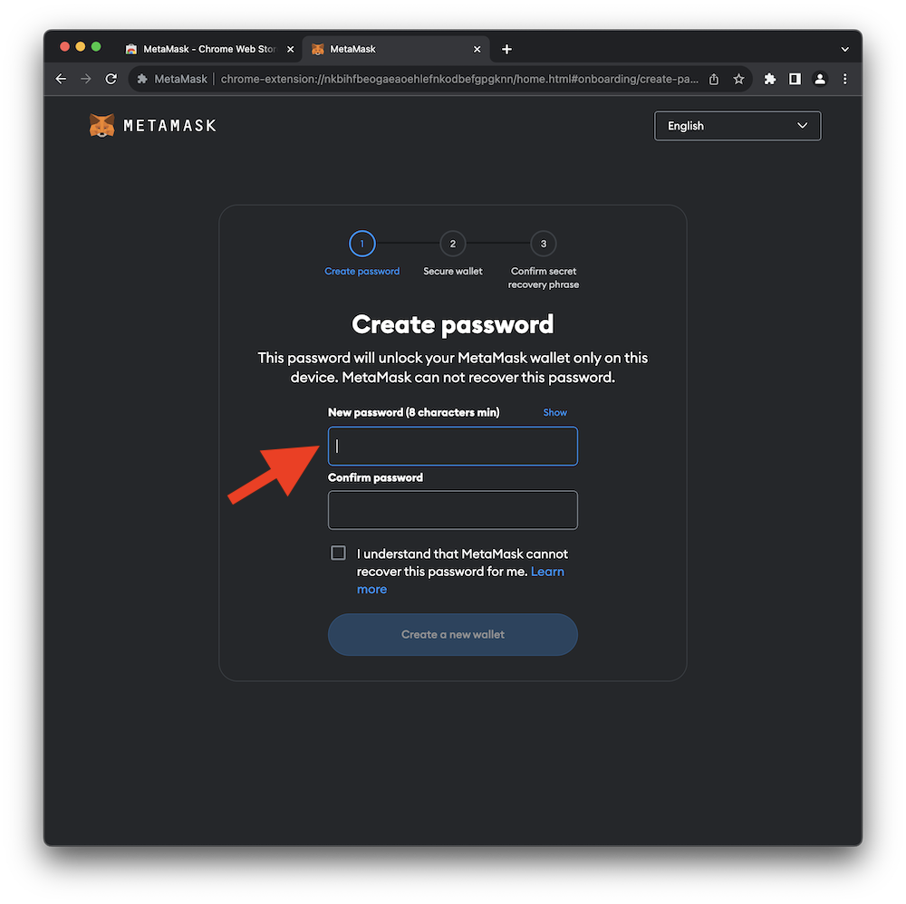
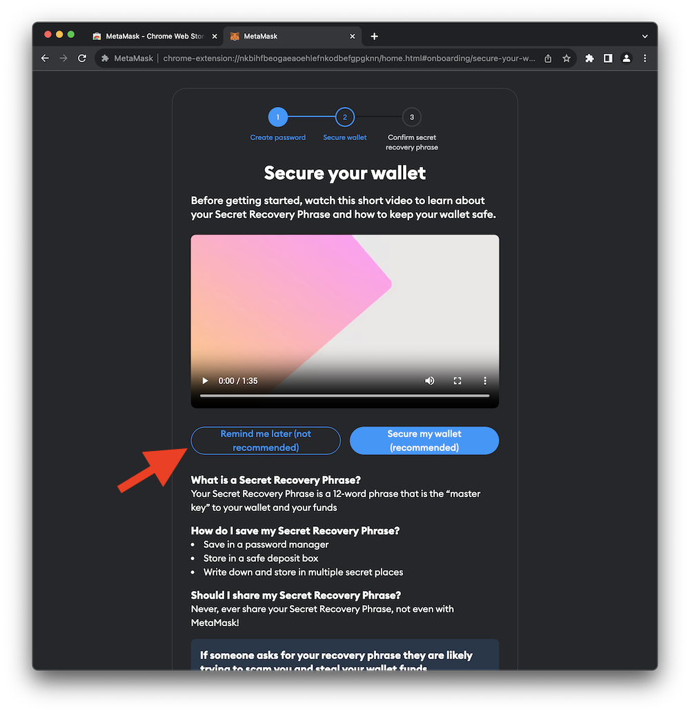
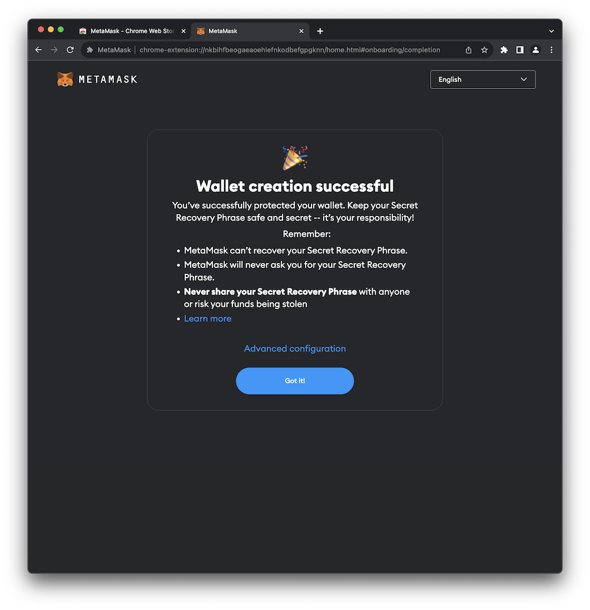
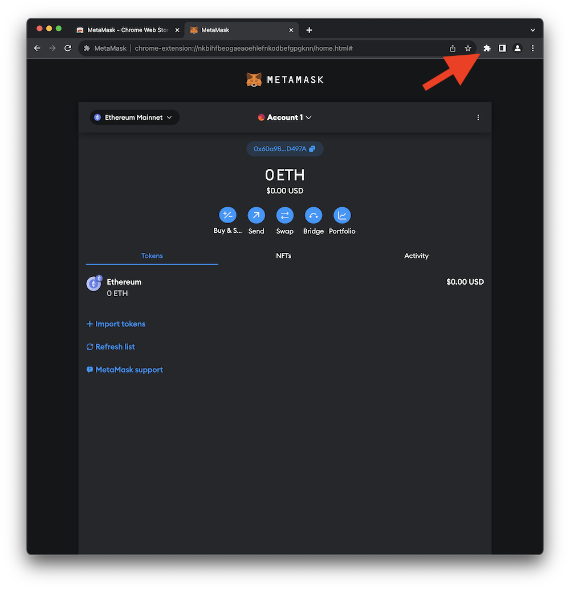
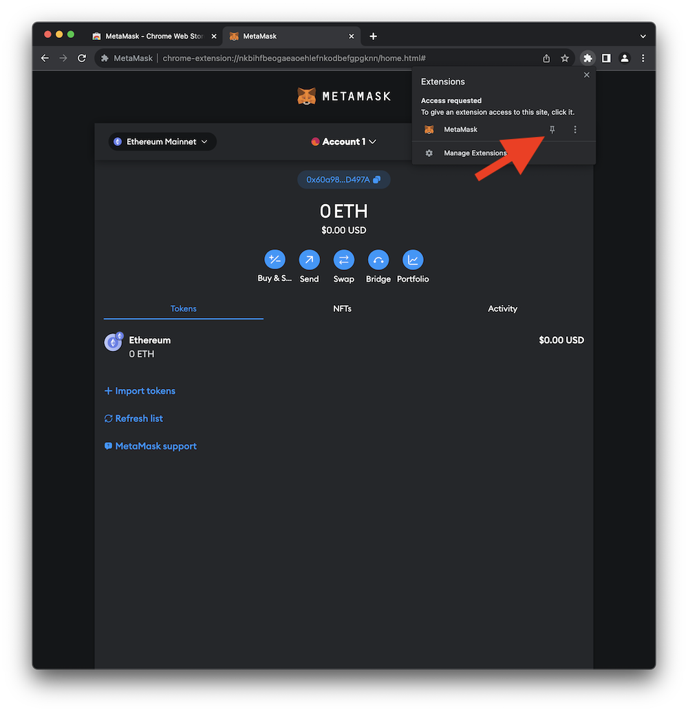

# MetaMask Installation

[MetaMask](https://metamask.io) is a software crypto wallet that can be used to interact with a wide variety of crypto blockchains. MetaMask is distributed as a standalone app for both iOS and Android. Additionally, it can be installed as a browser extension in most commonly used web browsers, including Chrome, Firefox, Brave, Edge, and Opera. Continue below to install and configure MetaMask for this guide.    

!!! info
    The term **_wallet_** is an unfortunate bit of nomenclature in the crypto space and often misleads newcomers. Unlike a physical wallet that may hold cash and credit cards, a crypto wallet doesn't actually store any digital assets. Instead, a crypto wallet stores the **_public and private cryptographic keys_** required to digitally sign crypto transactions. All digital assets exist on the blockchain. When interacting with a blockchain, transactions can be signed using the crypto wallet containing your **_private key_**.

!!! warning
    Keep your **_private keys_** **PRIVATE** and **SAFE**. As long as you have your private keys, you can always access your assets on the blockchain. Of course, if someone else has your private keys, they can also access your assets.

!!! warning
    MetaMask is a convenient crypto wallet for testing and debugging smart contracts and even for storing small amounts of digital assets. However, it's a software program running on an online device. That makes it potentially vulnerable to a wide variety of attacks. When deploying production smart contracts or interacting with crypto accounts that have real value, it is **HIGHLY** recommended that you utilize an offline hardware wallet.

 

## Install Browser Extension

1. Select your web browser below and install the MetaMask extension.
     
    <figure class="item">
        <a href="https://chrome.google.com/webstore/detail/metamask/nkbihfbeogaeaoehlefnkodbefgpgknn" target="_blank" rel="noopener noreferrer">
        
        <figcaption class="figure-caption">Chrome</figcaption>
        </a>
    </figure>
    <figure class="item">
        <a href="https://addons.mozilla.org/en-US/firefox/addon/ether-metamask/" target="_blank" rel="noopener noreferrer">
        
        <figcaption class="figure-caption">Firefox</figcaption>
        </a>
    </figure>
    <figure class="item">
        <a href="https://chrome.google.com/webstore/detail/metamask/nkbihfbeogaeaoehlefnkodbefgpgknn" target="_blank" rel="noopener noreferrer">
        
        <figcaption class="figure-caption">Brave</figcaption>
        </a>
    </figure>
    <figure class="item">
        <a href="https://microsoftedge.microsoft.com/addons/detail/metamask/ejbalbakoplchlghecdalmeeeajnimhm?hl=en-US" target="_blank" rel="noopener noreferrer">
        
        <figcaption class="figure-caption">Edge</figcaption>
        </a>
    </figure>
    <figure class="item">
        <a href="https://addons.opera.com/en-gb/extensions/details/metamask-10/" target="_blank" rel="noopener noreferrer">
        
        <figcaption class="figure-caption">Opera</figcaption>
        </a>
    </figure>
    
    For example, in Chrome click **Add to Chrome** as shown in the image below.
    { loading=lazy width="600" }
2. When the installation starts, you'll need to agree to the _Terms of Use_ and then click **Create a new wallet**.
     
    { loading=lazy width="600" }
3. Since the MetaMask software wallet is used to sign crypto transactions it's very important to secure the account with a strong password.
     
    { loading=lazy width="600" }
4. Typically, this would be a great time to save the **Secret Recovery Phrase** somewhere secret, somewhere safe. Your **Secret Recovery Phrase** is used to generate your **_private key_** and can be used to recover an account if you computer explodes or sinks to the bottom of a lake. However, since the account you just created is merely for this guide and won't ever store any real assets you can skip this step.
     
    { loading=lazy width="600" }
5. At this point your wallet should be successfully created.
     
    { loading=lazy width="600" }
6. In the future, you can access the MetaMask wallet from the extensions menu of your web browser as shown in the image below.
     
    { loading=lazy width="600" }
7. Some web browsers, like Chrome, will allow you to **_pin_** the extension to the toolbar making it easier to find in the future.
     
    { loading=lazy width="600" }

